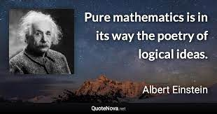
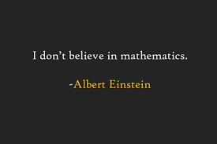

// BEGIN AsciiDoc Document Header
:sectlinks:
:sectanchors: before
:icons: font
:tip-caption: 💡Tip
:caution-caption: 🔥Caution
:important-caption: ❗️Important
:warning-caption: 🧨Warning
:note-caption: 🔖Note
// After blank line, BEGIN asciidoc

[quote, Albert Einstein,Sidelights on Relativity (1920), 28]
____
*Pure mathematics is, in its way, the poetry of logical ideas.*

*One seeks the most general ideas of operation which will bring together in simple, logical and unified form the largest possible circle of formal relationships.*

*In this effort toward logical beauty spiritual formulas are discovered necessary for the deeper penetration into the laws of nature.*

*It is mathematics that offers the exact natural sciences a certain measure of security which, without mathematics, they could not attain.*
____

---

[quote,A. Einstein]

____

*How can it be that mathematics, being after all a product of human thought which is independent of experience, is so admirably appropriate to the objects of reality ?*

*Is human reason, then, without experience, merely by taking thought, able to fathom the properties of real things ?*

*Insofar as mathematics is about reality, it is not certain, and insofar as it is certain, it is not about reality.*

*The formulation of a problem is often more essential than its solution, which may be merely a matter of mathematical or experimental skill.*

*To raise new questions, new possibilities, to regard old problems from a new angle requires creative imagination and marks real advances in science.*

*… how the real proof should run. The main thing is the content, not the mathematics. With mathematics one can prove anything.*
____
---

*I don't believe in mathematics -* _An off-hand remark when discussing the rigid rules of mathematics in a café conversation with engineer Gustave Ferrière._

---

_The most incomprehensible thing about the world is that it is at all comprehensible (in 1927)._

[quote,Albert Einstein, On the Generalized Theory of Gravitation - Scientific American (Apr 1950)]

____

---
*There exists a passion for comprehension, just as there exists a passion for music. That passion is rather common in children but gets lost in most people later on.*

*Without this passion, there would be neither mathematics nor natural science.*
____
___