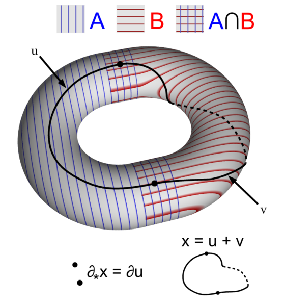
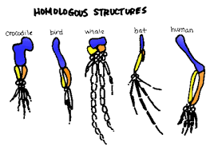

// BEGIN AsciiDoc Document Header
:sectlinks:
:sectanchors: before
:icons: font
:tip-caption: 💡Tip
:caution-caption: 🔥Caution
:important-caption: ❗️Important
:warning-caption: 🧨Warning
:note-caption: 🔖Note
// After blank line, BEGIN asciidoc

 
_quantam_

---

_YhSzm_

## links

- https://mathworld.wolfram.com/Homology.html[on Wolfram]
- https://fr.wikipedia.org/wiki/Homologie_(math%C3%A9matiques)[en français sur Wikipedia]

_Homologous structures_