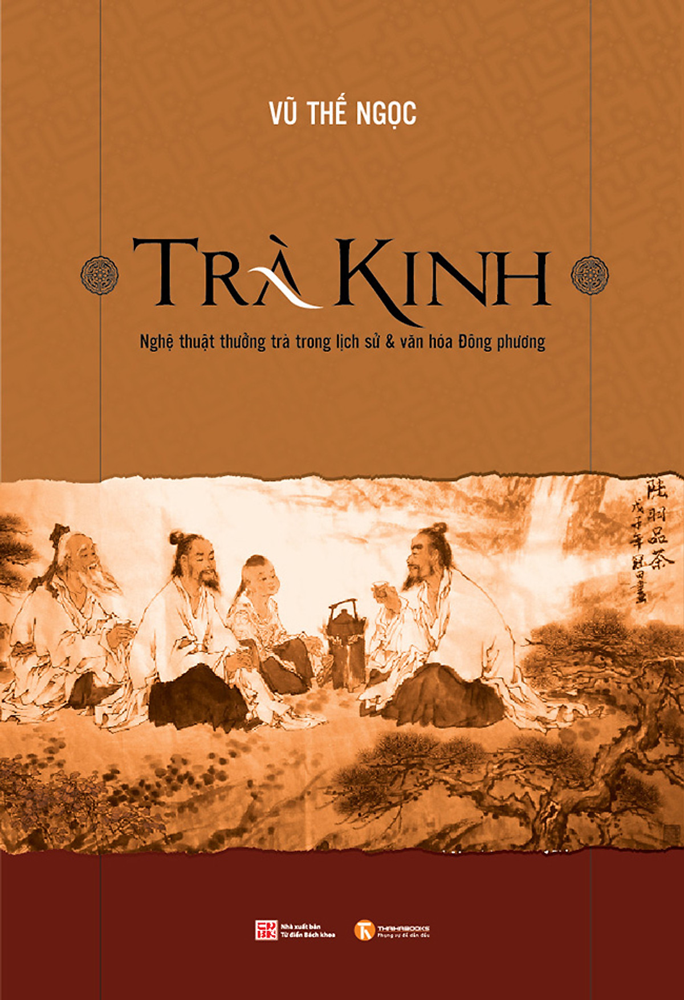
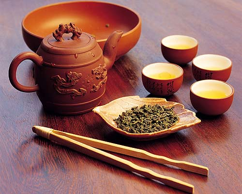

// BEGIN AsciiDoc Document Header
:sectlinks:
:sectanchors: before
// After blank line, BEGIN asciidoc

//:icons: font

:tip-caption: 💡Tip
:caution-caption: 🔥Caution
:important-caption: ❗️Important
:warning-caption: 🧨Warning
:note-caption: 🔖Note

## Vũ Thế Ngọc - Trà Kinh
Nghệ thuật thưởng trà trong lịch-sử và văn hoá Đông phương

 "Dân tộc Việt Nam là một trong những dân tộc đã biết đến cây trà đầu tiên trong lịch sử loài người.
  Người Việt Nam đã uống trà từ ngàn năm nay, nhưng có lẽ đây là quyển sách đầu tiên viết về nghệ thuật uống trà của Đông phương
  bằng Việt ngữ tương đối đầy đủ hơn cả.”
  Mở đầu bằng một vài dòng tâm huyết, giản dị và gần gũi như cái cách người ta vẫn bắt đầu một câu chuyện,
  Trà Kinh sau đó đưa người đọc bước vào một thế giới của trà, vừa lạ vừa quen.
  Tác giả dẫn người đọc đi xuyên qua thời gian, dọc theo hành trình hàng ngàn năm phát triển của trà,
  tìm hiểu về nguồn gốc cây trà và tục uống trà qua các đời Đường, Tống, Minh, Thanh
  cho tới ngày nay.
  Đó là những câu chuyện, điển tích về trà,
  nhưng đan xen và ẩn sau tầng nghĩa bề mặt đó cũng chính là những câu chuyện về văn hóa,
  về nguồn cội.

## Tẩu bút tạ Mạnh gián nghị ký tân trà 走筆謝孟諫議寄新茶 •
Thư viết nhanh tạ ơn quan gián nghị họ Mạnh gửi trà mới

Thơ » Trung Quốc » Trung Đường » Lư Đồng

☆☆☆☆☆
[NOTE]
_Thể thơ:_ Cổ phong (cổ thể)
Thời kỳ: Trung Đường
_Từ khoá:_ trà (9)
_Chia sẻ_ trên Facebook
_Đăng bởi Vanachi_
https://www.thivien.net/L%C6%B0-%C4%90%E1%BB%93ng/T%E1%BA%A9u-b%C3%BAt-t%E1%BA%A1-M%E1%BA%A1nh-gi%C3%A1n-ngh%E1%BB%8B-k%C3%BD-t%C3%A2n-tr%C3%A0/poem-cwd22cTED0FtlMGOAisk5w[thivien.net]
[NOTE]
 _Một số bài cùng từ khoá_
- Sơ thức trà hoa (Trần Dư Nghĩa)
- Huệ trà kiêm trình giải đáp chi (Jingak Hyesim)
- Vị minh tiểu kệ đồng Phan sinh dạ toạ (Cao Bá Quát)
- Uống trà (Lê Minh Quốc)
- Còn một vị trà (Đỗ Quốc Thuấn)
[NOTE]
 _Một số bài cùng tác giả (Lô Đồng)_
- Hữu sở tư
- Lâu thượng nữ nhi khúc
- Thu mộng hành
- Tống Thiệu binh tào quy Giang Nam
- Nhân nhật lập xuân

走筆謝孟諫議寄新茶

**Tẩu bút tạ Mạnh gián nghị ký tân trà**

=== Thư viết nhanh tạ ơn quan gián nghị họ Mạnh gửi trà mới

日高丈五睡正濃，
Nhật cao ngũ trượng thuỵ chính nùng,
Mặt trời lên cao trượng rưỡi, đang lúc ta ngủ say.

軍將打門驚周公。
Quân tướng khấn môn kinh Châu Công.
Bỗng quân lính đập cửa làm kinh động Chu công

口云諫議送書信，
Khấu vân Gián Nghị Tống thư tín,
Nói có thư của quan gián nghị.

白絹斜封三道印。
Bạch quyên tà phong tam đạo ấn.
Gói lụa trắng có ba dấu niêm phong.

開緘宛見諫議面，
Khai giam uyển kiến Gián Nghị diện,
Mở gói như thấy dung mạo ông gián nghị

手閱月團三百片。
Thủ duyệt nguyệt đồ tam bách phiến.
Tự tay lựa ba trăm lá trà hình trăng non.

聞道新年入山裡，
Văn đạo tân niên nhập sơn lý,
Nghe nói đầu năm mới vào tận rừng sâu

蟄蟲驚動春風起。
Côn trùng kinh động xuân phong khởi.
Côn trùng kinh động, gió xuân nổi lên

天子須嘗陽羨茶，
Thiên tử vị thưởng Dương Tiến trà,
Nhà vua ban cho trà thơm Thường Dương

百草不敢先開花。
Bách thảo bất cảm tiên khai hoa.
Trăm loài cỏ không dám nở hoa trước.

 

仁風暗結珠琲瓃，
Nhân phong ám kết châu bội lôi,
Gió lành ngầm kết thành chuỗi ngọc

先春抽出黃金芽。
Tiên xuân trừu xuất hoàng kim nha.
Trước mùa xuân, nảy mầm non màu vàng pha.

摘鮮焙芳旋封裹，
Trích tiên bồi phương toàn phong lý,
Hái tươi, ướp thơm và gói kỹ

至精至好且不奢。
Chí tình chí hảo thả bất xa.
Cực tinh tuý, cực tốt lành mà không xa xỉ.

至尊之餘合王公，
Chí tôn chí dự hợp vương công,
Ơn thừa của vua, chỉ có ở nơi các vương công

何事便到山人家。
Hà sự tiện đáo sơn nhân gia.
Sao hôm nay lại tới nhà của kẻ nơi rừng rú?

 

柴門反關無俗客，
Sài môn phản quan vô tục khách,
Khép cổng tre không tiếp khách tục

紗帽籠頭自煎喫。
Sa mạo long đầu tự tiễn khuyết.
Đội mũ mão nghiêm chỉnh, tự tay đun nước.

碧雲引風吹不斷，
Bích vân dẫn phong xuy bất đoạn,
Mây xanh lùa gió thổi không ngớt

白花浮光凝碗面。
Bạch hoa phù quang ngưng oản diện.
Ánh sáng bồng bềnh màu hoa trắng ngưng kết trên mặt chén trà.

 

一碗喉吻潤，
Nhất oản hầu vẫn nhuận,
Chén thứ nhất trơn miệng thông họng.

兩碗破孤悶。
Nhị oản phá cô sầu.
Chén thứ hai xua tan sự cô đơn phiền muộn.

三碗搜枯腸，
Tam oản sưu khô trường,
Chén thứ ba dốc sạch nỗi lòng

唯有文字五千卷。
Duy hữu văn tự ngũ thiên quyển.
Chỉ còn năm nghìn cuốn sách

四碗發輕汗，
Tứ oản phát khinh hạn,
Chén thứ tư toát mồ hôi

平生不平事，
Bình sinh bất bình sự,
Mọi nỗi bất bình trong đời

盡向毛孔散。
Tận hướng mao khổng tán.
Thoát hết ra ngoài theo lỗ chân lông.

五碗肌骨清，
Ngũ oản cơ phu thanh,
Chén thứ năm xương thịt đều trong sạch.

六碗通仙靈。
Lục oản thông tiên linh.
Chén thứ sáu thông lên cõi tiên.

七碗喫不得也，
Thất oản khiết bất đắc dã,
Chén thứ bảy không nhấp nổi

唯覺兩腋習習清風生。
Duy giác lưỡng dịch tập tập thanh phong sinh.
Chỉ thấy lớp lớp gió mát sinh ra từ hai bên nách.

 

蓬來山，在何處？
Bồng Lai sơn tại hà xứ?
Núi Bồng Lai ở đâu?

玉川子，乘此清風欲歸去。
Ngọc Xuyên Tử, thừa thử thanh phong dục quy khứ.
Ngọc Xuyên Tử cưỡi gió này sắp đến đó.

山上群仙司下土，
Sơn thượng quần tiên ty hạ thổ,
Các vị tiên trên núi xa nơi hạ giới

地位清高隔風雨。
Địa vị thanh cao cách phong vũ.
Địa vị thanh cao cách biệt mưa gió.

安得知百萬億蒼生命，
An đắc tri bách vạn thương sinh mệnh,
Đâu biết trăm vạn muôn số phận chúng sinh

墮在巔崖受辛苦。
Đoạ tại điên nhai thụ tân khổ.
Rơi xuống ngục sâu chịu đau khổ.

便為諫議問蒼生，
Tiện tùng Gián Nghị vấn thương sinh.
Nhân đây xin hỏi quan gián nghị:

到頭還得蘇息否？
Đáo đầu hoàn đắc tô tức phủ?
Dân chúng có được hưởng sung sướng chăng?

image::thu-choi-tra-cua-nguoi-xua.jpeg[]
Bài này còn được chép với tên Trà ca 茶歌.