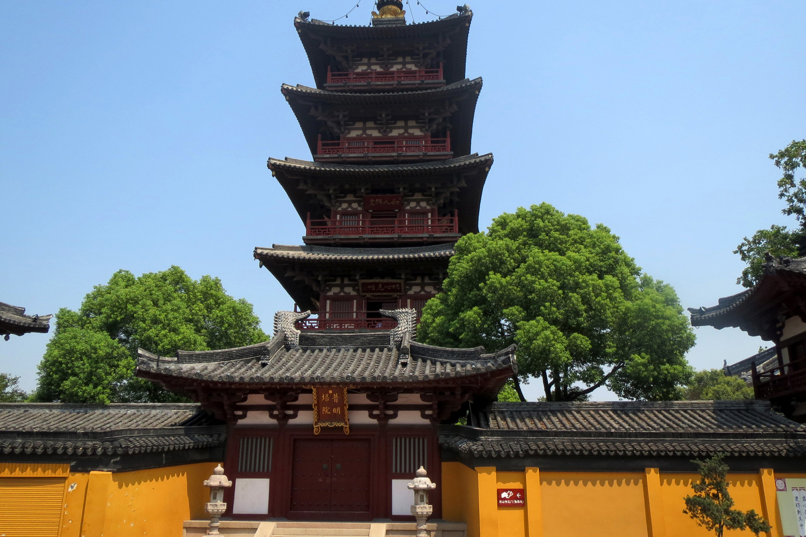

// BEGIN AsciiDoc Document Header
:sectlinks:
:sectanchors: before
// After blank line, BEGIN asciidoc

:tip-caption: 💡Tip
:caution-caption: 🔥Caution
:important-caption: ❗️Important
:warning-caption: 🧨Warning
:note-caption: 🔖Note

Hàn San Tự Các
[quote,Hồ Dzếnh (Hà Triệu Anh), Chân Trời Cũ - Ngày Gặp Gỡ ]

____
_Lắng biết mọi người đã ngủ yên cả, vị thần tử của giang sơn Trung Hoa vắt chân chữ
ngũ, khe khẽ ngâm một bài thơ cổ, qua nỗi xúc động đột nhiên tụ lại
trong người:_

*Uỵt loọc, vú thày sướng mủn thín,*

(Nguyệt lạc, ô đề sương mãn thiên)

*Coóng phống, dì phố, tui sàu mìn.*

(Giang phong, ngư hoả, đối sầu miên)

*Cú Chấu sèng ngồi Hồn Sán Sì,*

(Cô tô thành ngoại Hàn San Tự,)

*Dề pun, chống séng tâu hác sin.*

(Dạ bán, chung thanh đáo khách thuyền)

_Ngay lúc ấy, từ gian buồng bên, nổi lên mấy tiếng gì như chuột rúc. Lữ
khách, thấy đứt mạch cảm hứng, càu nhàu trong bóng tối:_

_- Ấy dà! Cẩm tố xỉ a! (Chà! Lắm chuột thế!)_

_Nhưng đó không phải tiếng chuột rúc. Đó là tiếng người con gái chở đò
ban tối cười qua hai làn môi khép kín.
____

[quote, Vũ Thư Hiên, 26-10-2016 https://dutule.com/a7831/vu-thu-hien-ho-dzenh- ]

____
Cuốn "Chân Trời Cũ" văn gồm nhiều truyện ngắn, theo ghi chú của tác giả
thì nó được viết vào tháng Giêng năm 1940, xuất bản lần đầu năm 1942. Nó
được tái bản nhiều lần về sau này. Tôi rất nhớ hai câu kết của truyện
ngắn "Ngày Gặp Gỡ":

"Người khách sang sông chiều muộn ấy về sau này là cha tôi. Và cô lái
đò, là mẹ tôi."
____
___