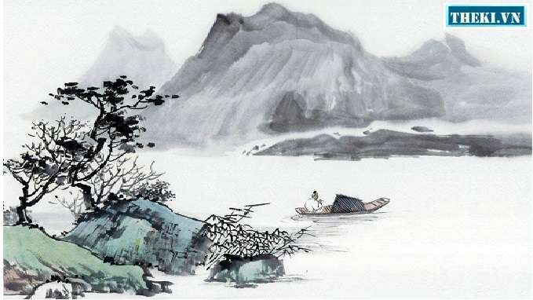
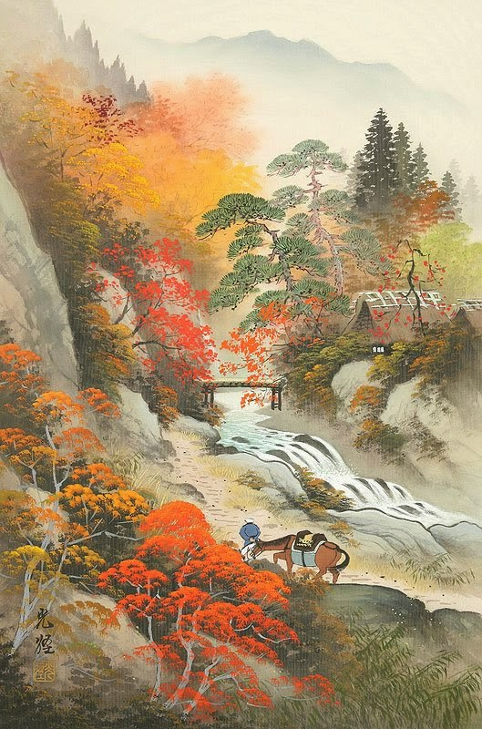

// BEGIN AsciiDoc Document Header
:sectlinks:
:sectanchors: before
:icons: font
:tip-caption: 💡Tip
:caution-caption: 🔥Caution
:important-caption: ❗️Important
:warning-caption: 🧨Warning
:note-caption: 🔖Note
// After blank line, BEGIN asciidoc

[verse]
____
** Thu hứng 秋興 **
_Cảm xúc mùa thu_

玉露凋傷楓樹林，
Ngọc lộ điêu thương phong thụ lâm,
_Trong rừng phong, móc ngọc tơi bời,_

巫山巫峽氣蕭森。
Vu sơn, Vu giáp khí tiêu sâm.
_Nơi núi Vu và kẽm Vu, khí ảm đạm hiu hắt._

江間波浪兼天湧，
Giang gian ba lãng kiêm thiên dũng,
_Dưới lòng sông, sóng và trời (soi bóng) cùng dâng trào,_

塞上風雲接地陰。
Tái thượng phong vân tiếp địa âm.
_Ngoài ải, gió và mây tiếp nối với đất che mờ mịt._

叢菊兩開他日淚，
Tùng cúc lưỡng khai tha nhật lệ,
_Khóm cúc.footnote:1["Tùng cúc" nghĩa là bụi hay khóm cúc. Có lẽ đó không phải là bụi cúc trồng ở vườn xưa, mà là một bụi cúc chở theo trên thuyền đã hai năm, cứ mỗi lần nở lại làm chủ thuyền nhớ nhà rơi lệ.]dày đã hai lần nở chảy ra dòng lệ ngày trước,_

孤舟一繫故園心。
Cô chu nhất hệ cố viên tâm.
_Con thuyền lẻ loi vẫn buộc chặt nỗi lòng nhớ quê nhà._

寒衣處處催刀尺，
Hàn y xứ xứ thôi đao xích.footnote:2["Đao xích" nghĩa là kéo và thước may, theo Hán Việt từ điển của Đào Duy Anh. Vậy "đao" đây là "tiễn đao", tức là cái kéo.],
_Nơi nơi giục giã dao thước may áo rét,_

白帝城高急暮砧。
Bạch Đế thành cao cấp mộ châm.
_Thành cao Bạch Đế tiếng chày đập áo lúc chiều tối dồn dập.footnote:3[Người Tàu xưa giặt áo, giặt vải bằng cách đặt lên một tảng đá rồi dùng chày mà nện. Khi rét về, cần áo ấm, có thể giặt áo cũ hoặc giặt vải để cắt may áo mới.]_

(Năm 766)
____

___

[quote, Bản dịch của Nguyễn Công Trứ]

____
 Lác đác rừng phong hạt móc sa,
 Ngàn non hiu hắt, khí thu mờ.
 Lưng trời sóng gợn lòng sông  thẳm,
 Mặt đất mây đùn cửa ải xa.
 Khóm cúc tuôn thêm dòng lệ cũ,
 Con thuyền buộc chặt mối tình già.
 Lạnh lùng giục kẻ tay đao thước,
 Thành Bạch chầy vang bóng ác tà.
____