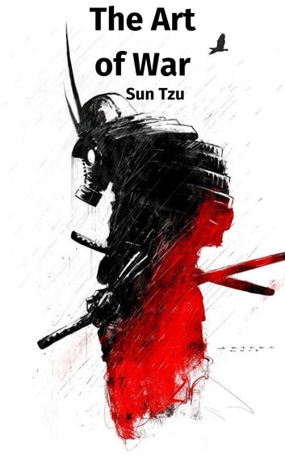
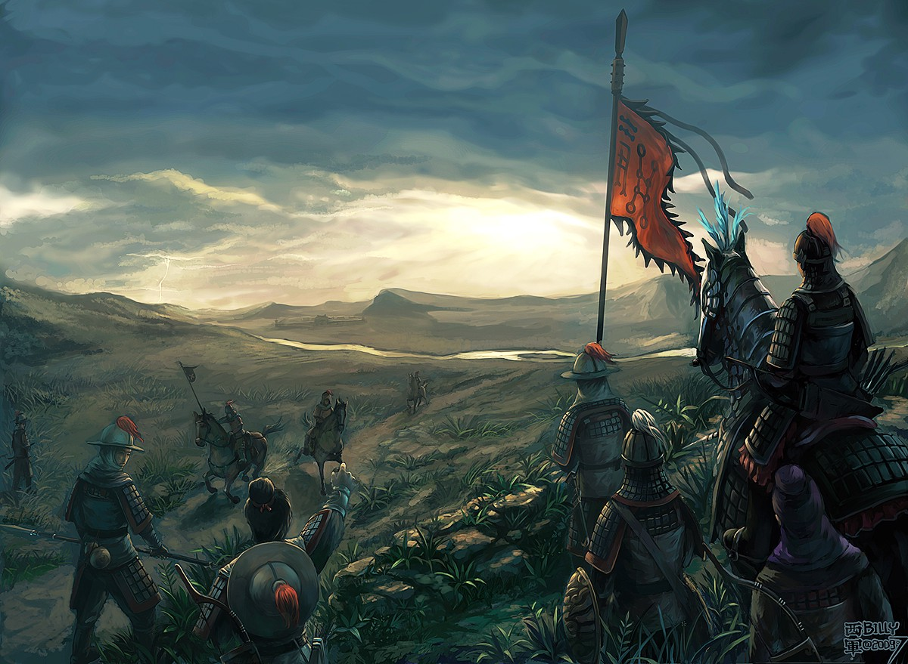
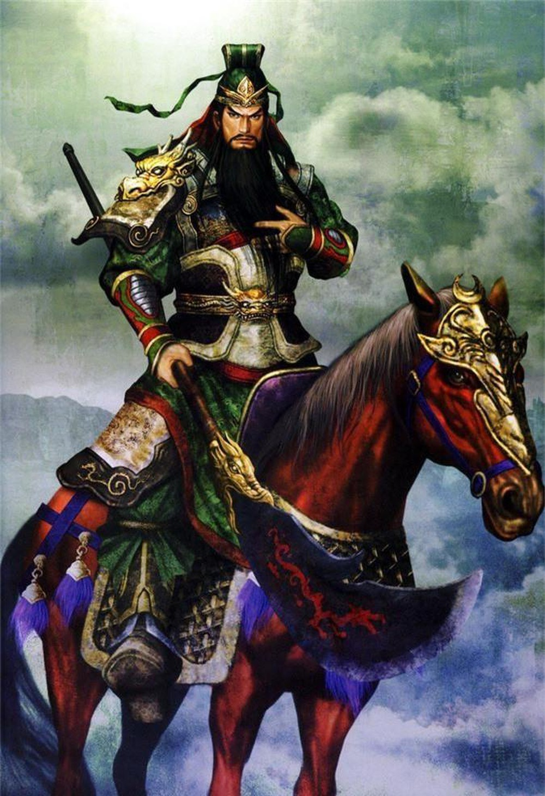
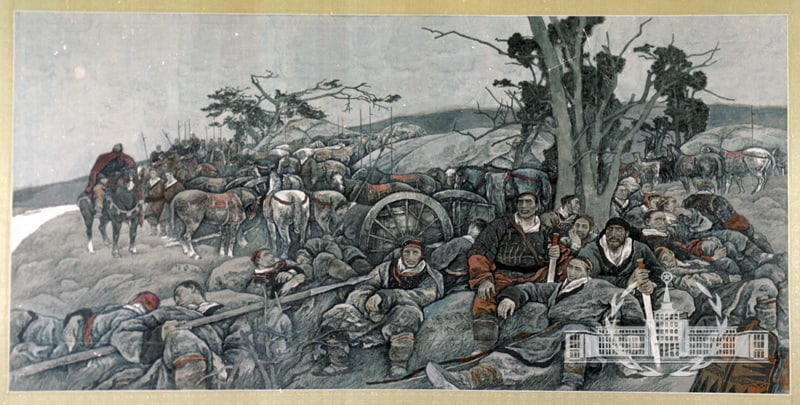
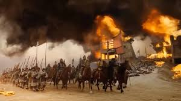
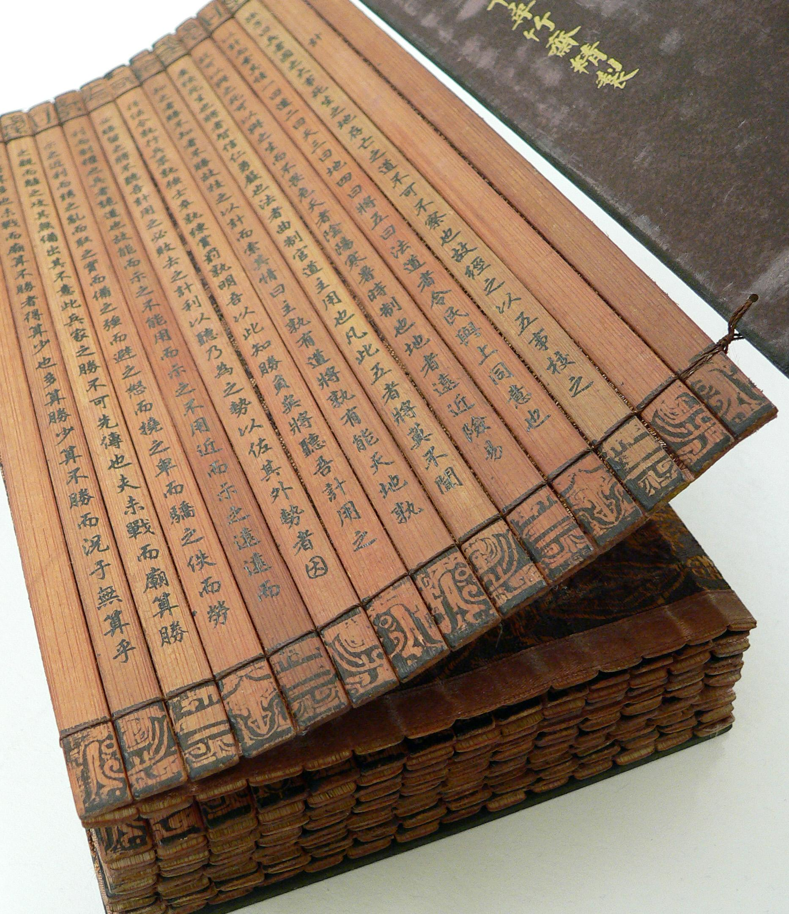

// BEGIN AsciiDoc Document Header
:sectlinks:
:sectanchors: before
:icons: font
:tip-caption: 💡Tip
:caution-caption: 🔥Caution
:important-caption: ❗️Important
:warning-caption: 🧨Warning
:note-caption: 🔖Note
// After blank line, BEGIN asciidoc

## Tôn Tử binh pháp 
(_chữ Hán:_ 孫子兵法 / 孙子兵法; _Pinyin:_ Sūnzĭ Bīngfǎ; _WG:_ Sun1 Tzu3 Ping1 Fa3;) soạn thảo vào năm 512 TCN đời Xuân Thu.
https://vi.wikipedia.org/wiki/Binh_ph%C3%A1p_T%C3%B4n_T%E1%BB%AD[wikipedia link]

Tôn tử binh pháp 13 thiên gồm: 

* Thiên thứ nhất: Kế sách (計 索，计索)
* Thiên thứ hai: Tác chiến (作 戰，作战)
* Thiên thứ ba: Mưu công (謀 攻， 谋攻)
* Thiên thứ tư: Quân Hình (軍 形，军形)
* Thiên thứ năm: Binh Thế (兵 勢，兵势)
* Thiên thứ sáu: Hư thực (虛 實，虚实) 
* Thiên thứ bảy: Quân tranh (軍 爭，军争)
* Thiên thứ tám: Cửu biến (九 變，九变) 
* Thiên thứ chín: Hành quân (行 軍，行军)
* Thiên thứ mười: Địa hình (地 形)
* Thiên thứ mười một: Cửu địa (九 地) 
* Thiên thứ mười hai: Hỏa công (火 攻) 
* Thiên thứ mười ba: Dụng gián (用 間，用间)

___

## Kế sách thiên (計 索 篇)

Tào Tháo viết:: Kế giả, tuyển tướng, lượng địch, độ địa, liệu tốt, viễn cận, hiểm dị, kế vu miếu đường dã.

___

Nguyên văn:: 
孫子曰：兵 者，國 之 大 事，死 生 之 地，
存 亡 之 道，不 可 不 察 也 故 经 之 以 五 事，
校 之 以 计 而 索 其 情：
一 曰 道，
二 曰 天，
三 曰 地，
四 曰 将，
五 曰 法。
道 者，令 民 与 上 同 意 也，
故 可 以 与 之 死，可 以 与 之 生，
而 不 畏 危。天 者，阴 阳、寒 暑、
时 制 也。地 者，远 近、险 易、
广 狭、死 生 也。
将 者，智、信、仁、勇、严 也。
法 者，曲 制、官 道、主 用 也。

Hán Việt:: 
Tôn Tử viết:: Binh giả, quốc chi đại sự. Tử sinh chi địa, tồn vong chi đạo, bất khả bất sát dã.
Cố kinh chi dĩ ngũ sự , hiệu chi dĩ kế nhi sách kỳ tình: 

  . nhất viết _đạo_ (道),
  . nhị viết _thiên_ (天),
  . tam viết _địa_ (地),
  . tứ viết _tướng_ (将),
  . ngũ viết _pháp_ (法).

* _Đạo_ giả, lệnh(令) dân dữ thượng đồng ý dã , cố khả  dĩ dữ chi tử , khả dĩ dữ chi sinh , nhi bất uý nguy(危) . 
* _Thiên_ giả, âm dương(阴阳), hàn thử(寒暑), thời chế(时制) dã . 
* _Địa_ giả, viễn cận, hiểm dị(险易) , quảng hiệp(广狭), tử sinh dã . 
* _Tướng_ giả, trí(智), tín(信), nhân(仁), dũng(勇), nghiêm(严) dã . 
* _Pháp_ giả, khúc chế(曲制) ,quan đạo(官道) , chủ dụng dã . 

凡 此 五 者，將 莫 不 聞，知 之 者 勝，不 知 之
者 不 勝。故 校 之 以 計，而 索 其 情。

Phàm thử ngũ giả, tướng mạc bất văn, tri chi giả thắng, bất tri giả bất thắng. Cố hiệu chi dĩ kế, nhi sách kỳ tình. 

曰：主 孰 有 道？將 孰 有 能 ？天 地 孰 得 ？法 令 孰 行？
兵 眾 孰 強 ？士 卒 孰 練 ？
賞 罰 孰 明 ？吾 以 此 知 勝 負 矣。

Viết: Chủ thục hữu đạo? Tướng thục hữu năng? Thiên địa thục đắc? Pháp lệnh thục hành? Binh chúng thực cường? Sĩ tốt thục luyện? Thưởng phạt thục minh? Ngô dĩ thử tri thắng phụ hĩ.

將 聽 吾 計，用 之 必 勝，留 之 ﹔
將 不 聽 吾 計，用 之 必 敗，去 之 。

Tướng thính ngô kế, dụng chi tất thắng, lưu chi. Tướng bất thính ngô kế, dụng chi tất bại, khứ chi.

計 利 以 聽，乃 為 之 勢，以 佐 其 外。勢 者，因 利 而 制 權 也。

Kế lợi dĩ thính, nãi vị chi thế, dĩ tá kỳ ngoại; thế giả, nhân lợi nhi chế quyền dã.

Tào tháo viết:: Tướng nghi ngũ đức bị dã

Tào tháo viết chú:: Làm tướng phải có đầy đủ ngũ đức theo như Tôn Tử. Đó là: Trí, Tín, Nhân, Dũng, Nghiêm.

Viết:: Phàm thử ngũ giả, tướng mạc bất văn, tri chi giả thắng, bất tri giả bất thắng. Cố hiệu chi dĩ kế, nhi sách kỳ tình.

Viết:: Chủ thục hữu đạo? Tướng thục hữu năng? Thiên địa thục đắc? Pháp lệnh thục hành? Binh chúng thực cường? Sĩ tốt thục luyện? Thưởng phạt thục minh? Ngô dĩ thử tri thắng phụ hĩ.

___

_Battle of Gaixia_

Nguyên văn:: 
將 聽 吾 計，用 之 必 勝，留 之﹔
將 不 聽 吾 計，用 之 必 敗，去之。

Tướng thính ngô kế, dụng chi tất thắng, lưu chi. Tướng bất thính ngô kế, dụng chi tất bại, khứ chi.

Nguyên văn:: 
計 利 以 聽，乃 為 之 勢，以 佐 其 外 。
勢 者 ，因 利 而 制 權 也 。

Kế lợi dĩ thính, nãi vị chi thế, dĩ tá kỳ ngoại; thế giả, nhân lợi nhi chế quyền dã.

___

Nguyên văn:: 
兵 者，诡 道 也。
故 能 而 示 之 不 能 ，
用 而 示 之 不 用 ，
近 而 示 之 远 ，
远 而 示 之 近 ；
利 而 诱 之 ，乱 而 取 之 ，
实 而 备 之 ，强 而 避 之 ，
怒 而 挠 之 ，卑 而 骄 之 ，
佚 而 劳 之 ，亲 而 离 之 。
攻 其 无 备 ，出 其 不 意 。
 
Hán Việt:: Binh(兵) giả , quỷ(诡) đạo dã . cố năng nhi thị(示) chi bất năng , dụng(用) nhi thị chi bất dụng , cận(近) nhi thị chi viễn(远) , viễn nhi thị chi cận ；lợi(利) nhi dụ(诱) chi , loạn(乱) nhi thủ(取) chi , thực(实) nhi bị(备) chi , cường(强)  nhi tỵ(避) chi , nộ(怒) nhi náo(挠) chi , ti(卑) nhi kiêu(骄) chi , dật(佚) nhi lao(劳) chi , thân(亲) nhi li(离) chi . công(攻) kỳ vô bị , xuất kỳ bất ý. Thủ binh gia chi thắng, bất khả tiên truyền dã. 

Nổi bật::

- Binh giả, quỷ đạo dã:: Đạo của binh pháp là đạo của thuật trá ngụy.

- Công kỳ vô bị, Xuất kỳ bất ý::  Công địch lúc không phòng bị, xuất binh khi địch không để ý. 

___

Nguyên văn:: 
夫 未 战 而 庙 算 胜 者 ，
得 算 多 也 ；未 战 而 庙 算 不 胜 者 ，
得 算 少 也 。多 算 胜 ，
少 算 不 胜 ，而 况 于 无 算 乎 ！
吾 以 此 观 之 ，胜 负 见 矣 。

Hán Việt:: Phù vị chiến nhi miếu toán(庙算) thắng(胜) giả , đắc toán đa dã ；vị chiến nhi miếu toán bất thắng giả , đắc toán thiểu dã . Đa toán thắng , thiểu toán bất thắng , nhi (况) ư vô toán hồ ！ngô dĩ thử quan chi , thắng phụ kiến hĩ.

Dịch nghĩa:: Chưa lâm chiến mà đã tính toán được thắng lợi từ trong miếu đường, là do tính toán nhiều ( _đắc toán_) và nhiều điều kiện thắng lợi ( _đa dã_). Chưa lâm chiến mà tính toán rằng sẽ không thắng, là do tính toán nhiều nhưng điều kiện thắng lợi chưa đầy đủ ( _thiểu dã_). Bởi vậy, tính toán nhiều sẽ biết trước được thắng bại, tính toán ít thì dễ thất bại, huống chi là người không hề tính toán gì.

Nổi bật:: 
- Đa toán thắng thiểu toán bất thắng ( 多算胜，少算不胜)::
 Dòng này thâu tóm ý nghĩa chính của binh pháp. Trước khi tiến hành một việc gì phải tính toán, mưu sự thật kỹ các tình huống có thể xảy ra và chuẩn bị kĩ cho từng tình huống.

- Thắng(胜) binh tiên thắng, nhi hậu(后) cầu chiến(战). Bại(败) binh tiên chiến, nhi hậu cầu thắng 
- (胜 兵 先 胜 而 后 求 战，败 兵 先 战 而 后 求 胜) 
_(Thiên 4: Quân Hình )_::
Người chiến thắng trước tiên tính toán thấy thắng lợi rồi mới lâm trận, người bại trước tiên lâm trận rồi mới mong chiến thắng.  

___

Nguyên văn:: 故 兵 贵 胜 ，不 贵 久 。

Hán Việt::  Cố binh quý thắng , bất quý cửu. ( Việc nhà binh quý thắng lợi và tốc độ chứ không quý việc đánh lâu dài ).

___

_Tôn Tử Binh Pháp_